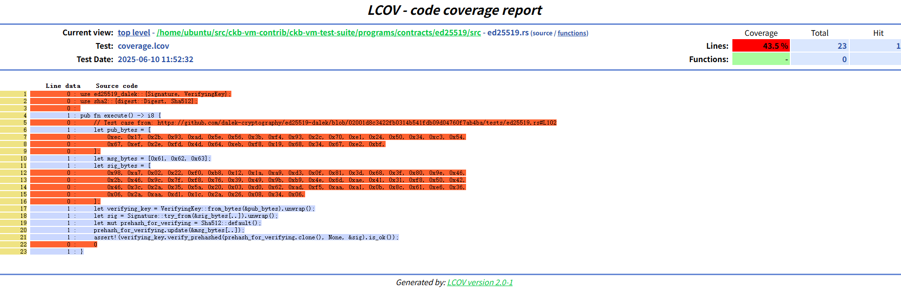

# Coverage Test

ckb-debugger's coverage is recorded in linux lcov format. You first need to install the lcov toolkit:

```sh
$ sudo apt install lcov
```

Use the following two commands to generate coverage records and convert the records into html pages:

```sh
$ ckb-debugger --bin /home/ubuntu/src/ckb-vm-contrib/ckb-vm-test-suite/programs/build/debug/ed25519_ckbvm.debug \
    --enable-coverage
    --coverage-output=coverage.lcov
$ genhtml coverage.lcov -o coverage_html
```



For speed reasons, the debugger coverage record only records whether a line of code has been run (Line data 1 or 0), but does not count how many times it has been run. This requires extra attention.
